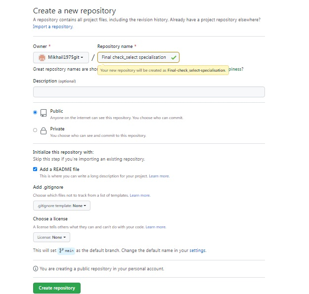
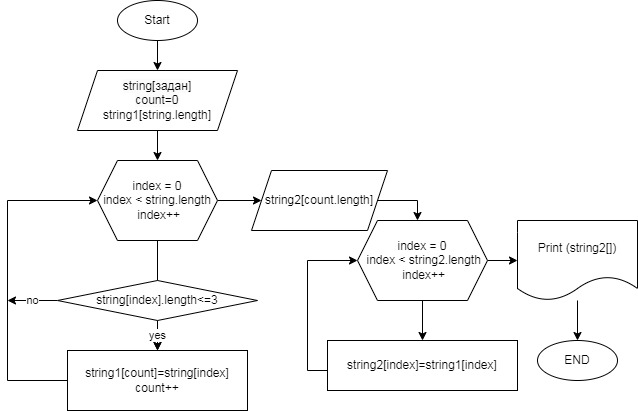

1 Создан репозиторий на GitHub

2 Нарисована блок-схема алгоритма

3 Описание решения:
  - новый массив string задан по условиям задачи
  - создаем новый массив string1 равный по длине массиву string
  - создаем счетчик count (для определения длины финального массива)
  - создаем цикл For для прохождения всех элементов заданного массива string с целью проверки длины всех его элементов
  - создаем условие If с условием, что если длина элемента первоначально заданного масива string меньше или равна 3, то значение элемента данного индекса записывается во вновь созданный массив string1 с номером индекса равного счетчику count. Счетчик count увеличивается на 1. При несоблюдении условия переходим на новый виток цикла For
  - При выходе из цикла For создаем новый массив string2 с длиной count.
  - создаем новый цикл For для прохождения всех заполненных элементов массива string1 (что равно длине массива string2) с целью заполнения массива string2
  - выводим на печать массив string2
